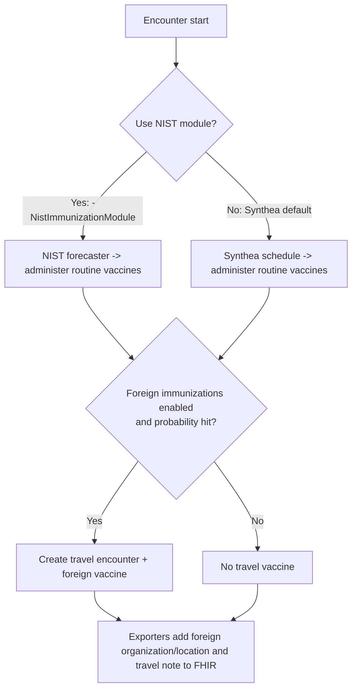

# Synthea<sup>TM</sup> Patient Generator  [](https://codecov.io/gh/synthetichealth/synthea)

Synthea<sup>TM</sup> is a Synthetic Patient Population Simulator. The goal is to output synthetic, realistic (but not real), patient data and associated health records in a variety of formats.

Read our [wiki](https://github.com/synthetichealth/synthea/wiki) and [Frequently Asked Questions](https://github.com/synthetichealth/synthea/wiki/Frequently-Asked-Questions) for more information.

Currently, Synthea<sup>TM</sup> features include:
- Birth to Death Lifecycle
- Configuration-based statistics and demographics (defaults with Massachusetts Census data)
- Modular Rule System
  - Drop in [Generic Modules](https://github.com/synthetichealth/synthea/wiki/Generic-Module-Framework)
  - Custom Java rules modules for additional capabilities
- Primary Care Encounters, Emergency Room Encounters, and Symptom-Driven Encounters
- Conditions, Allergies, Medications, Vaccinations, Observations/Vitals, Labs, Procedures, CarePlans
- Formats
  - HL7 FHIR (R4, STU3 v3.0.1, and DSTU2 v1.0.2)
  - Bulk FHIR in ndjson format (set `exporter.fhir.bulk_data = true` to activate)
  - C-CDA (set `exporter.ccda.export = true` to activate)
  - CSV (set `exporter.csv.export = true` to activate)
  - CPCDS (set `exporter.cpcds.export = true` to activate)
- Rendering Rules and Disease Modules with Graphviz

## Developer Quick Start

These instructions are intended for those wishing to examine the Synthea source code, extend it or build the code locally. Those just wishing to run Synthea should follow the [Basic Setup and Running](https://github.com/synthetichealth/synthea/wiki/Basic-Setup-and-Running) instructions instead.

### Installation

**System Requirements:**
Synthea<sup>TM</sup> requires Java JDK 11 or newer. We strongly recommend using a Long-Term Support (LTS) release of Java, 11 or 17, as issues may occur with more recent non-LTS versions.

To clone the Synthea<sup>TM</sup> repo, then build and run the test suite:
```
git clone https://github.com/synthetichealth/synthea.git
cd synthea
./gradlew build check test
```

### Changing the default properties


The default properties file values can be found at `src/main/resources/synthea.properties`.
By default, synthea does not generate CCDA, CPCDA, CSV, or Bulk FHIR (ndjson). You'll need to
adjust this file to activate these features.  See the [wiki](https://github.com/synthetichealth/synthea/wiki)
for more details, or use our [guided customizer tool](https://synthetichealth.github.io/spt/#/customizer).


### Generate Synthetic Patients
Generating the population one at a time...
```
./run_synthea
```

Command-line arguments may be provided to specify a state, city, population size, or seed for randomization.
```
run_synthea [-s seed] [-p populationSize] [state [city]]
```

Full usage info can be printed by passing the `-h` option.
```
$ ./run_synthea -h     

> Task :run
Usage: run_synthea [options] [state [city]]
Options: [-s seed]
         [-cs clinicianSeed]
         [-p populationSize]
         [-r referenceDate as YYYYMMDD]
         [-g gender]
         [-a minAge-maxAge]
         [-o overflowPopulation]
         [-c localConfigFilePath]
         [-d localModulesDirPath]
         [-i initialPopulationSnapshotPath]
         [-u updatedPopulationSnapshotPath]
         [-t updateTimePeriodInDays]
         [-f fixedRecordPath]
         [-k keepMatchingPatientsPath]
         [--config*=value]
         * any setting from src/main/resources/synthea.properties

Options added for Nist Immunization project:
         [-NistImmunizationModule]
         [-NistImmunizationModule -hesitantPatientPercentage percentage]                       // default value = 0
         [-NistImmunizationModule -hesitantPatientLastNames firstLetter]
         [-NistImmunizationModule -hesitantPatientZipCodePrefixes zipPrefixes]
         [-NistImmunizationModule -underVaxxedCliniciansPercentage percentage]             // default value = 0
         [-NistImmunizationModule -underVaxxedCliniciansLastName underVaxxedCliniciansFirstLetter]
         [-NistImmunizationModule -underVaxxedCliniciansZipCodePrefixes underVaxxedCliniciansZipPrefixes]
         [-NistImmunizationModule -noVaccineProbability percentage]                    // default value = 0
         [-NistImmunizationModule -noVaccineProbabilityHesitantPatient percentage]             // default value = 100
         [-NistImmunizationModule -noVaccineProbabilityClinician percentage]           // default value = 0
         [-NistImmunizationModule -noVaccineProbabilityUnderVaxxedClinician percentage]    // default value = 100
         [-NistImmunizationModule -testServer]                                         // use the test server of NIST for immunization recommendations
         

Examples:
run_synthea Massachusetts
run_synthea Alaska Juneau
run_synthea -s 12345
run_synthea -p 1000
run_synthea -s 987 Washington Seattle
run_synthea -s 21 -p 100 Utah "Salt Lake City"
run_synthea -g M -a 60-65
run_synthea -p 10 --exporter.fhir.export=true
run_synthea --exporter.baseDirectory="./output_tx/" Texas
run_synthea -NistImmunizationModule
run_synthea -NistImmunizationModule -hesitantPatientPercentage 90
run_synthea -p 50 -NistImmunizationModule -hesitantPatientZipCodePrefixes 010:80-023:90 
    --> patients from zip codes starting with 010 will have 80% chance of being hesitant, 
        patients from zip codes starting with 023 will have 90% chance of being hesitant
run_synthea -p 50 -NistImmunizationModule -hesitantPatientLastNames A:20-B:50-C:30 
    --> patients with last names (maiden names) starting with A will have 20% chance of being hesitant, 
        patients with last names starting with B will have 50% chance of being hesitant, 
        patients with last names starting with C will have 30% chance of being hesitant
run_synthea -NistImmunizationModule -underVaxxedCliniciansPercentage 100
run_synthea -p 50 -NistImmunizationModule -underVaxxedCliniciansLastName A:20-B:50-C:30 -underVaxxedCliniciansZipCodePrefixes 010:80-023:90
run_synthea -NistImmunizationModule -noVaccineProbability 100 
run_synthea -NistImmunizationModule -noVaccineProbabilityHesitantPatient 100
run_synthea -NistImmunizationModule -noVaccineProbabilityClinician 100 
run_synthea -NistImmunizationModule -noVaccineProbabilityUnderVaxxedClinician 100
run_synthea -NistImmunizationModule -testServer
run_synthea -NistImmunizationModule -a 2-7 -p 650 -hesitantPatientPercentage 20 -noVaccineProbability 10 -noVaccineProbabilityHesitantPatient 70
run_synthea -NistImmunizationModule -a 2-7 -p 100 -hesitantPatientPercentage 100 -noVaccineProbabilityHesitantPatient 90
run_synthea -NistImmunizationModule -a 2-7 -p 50 -hesitantPatientPercentage 100 -noVaccineProbabilityHesitantPatient 100
run_synthea -NistImmunizationModule -a 2-7 -p 100 -hesitantPatientPercentage 0 -noVaccineProbability 0
run_synthea -NistImmunizationModule -a 2-7 -p 100 -hesitantPatientPercentage 50 -noVaccineProbability 50
```

Some settings can be changed in `./src/main/resources/synthea.properties`.

Synthea<sup>TM</sup> will output patient records in C-CDA and FHIR formats in `./output`.


### Enabling foreign immunization generation
Foreign immunization events can be synthesized to represent travel encounters. Enable them by setting the properties in `src/main/resources/synthea.properties` (or by passing `--config` overrides to `run_synthea`):

- `generate.immunizations.foreign.enabled=true` — turn on foreign immunization generation.
- `generate.immunizations.foreign.default_country` — destination country code to use for travel encounters (default `CN`).
- `generate.immunizations.foreign.probability` — probability (0–1) that a patient will receive a foreign immunization (default `0.05`).

Example CLI override:
```
./run_synthea --generate.immunizations.foreign.enabled=true \
              --generate.immunizations.foreign.default_country=CN \
              --generate.immunizations.foreign.probability=0.5
```

#### How the immunization flows interact


### Docker

Build the container image:

```sh
docker build -t synthea .
```

Run Synthea (output will be written to a local `output/` directory):

```sh
docker run --rm -v "$PWD/output:/opt/synthea/output" synthea -p 10
```
Command breakdown:
| Element | Meaning |
| --- | --- |
| `--rm` | Remove the container after execution. |
| `-v "$PWD/output:/opt/synthea/output"` | Map container output → host `output/` directory. |
| `synthea` | Image name. |
| `-p 10` | CLI argument passed to the container entrypoint. |

You can pass any of the usual Command-Line Interface (CLI) options after the image name, for example:

```sh
docker run --rm -v "$PWD/output:/opt/synthea/output" synthea -NistImmunizationModule -p 50
docker run --rm -v "$PWD/output:/opt/synthea/output" synthea -NistImmunizationModule -p 2 --generate.immunizations.foreign.enabled=true --generate.immunizations.foreign.default_country=CN --generate.immunizations.foreign.probability=0.5
```

### Synthea<sup>TM</sup> GraphViz
Generate graphical visualizations of Synthea<sup>TM</sup> rules and modules.
```
./gradlew graphviz
```

### Concepts and Attributes
Generate a list of concepts (used in the records) or attributes (variables on each patient).
```
./gradlew concepts
./gradlew attributes
```

# License

Copyright 2017-2023 The MITRE Corporation

Licensed under the Apache License, Version 2.0 (the "License");
you may not use this file except in compliance with the License.
You may obtain a copy of the License at

    http://www.apache.org/licenses/LICENSE-2.0

Unless required by applicable law or agreed to in writing, software
distributed under the License is distributed on an "AS IS" BASIS,
WITHOUT WARRANTIES OR CONDITIONS OF ANY KIND, either express or implied.
See the License for the specific language governing permissions and
limitations under the License.
